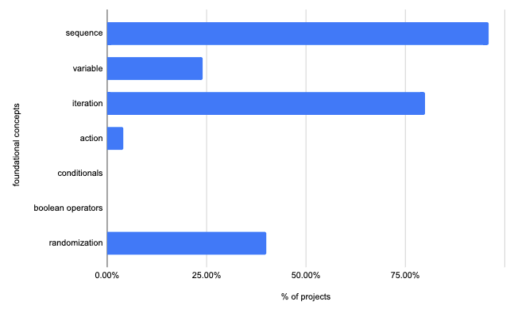
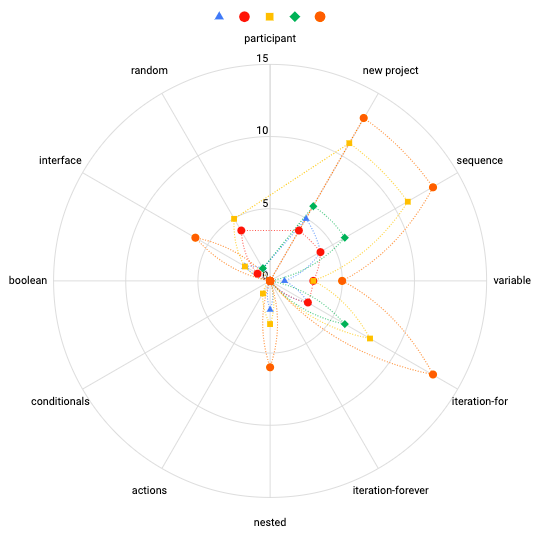

## Exploring Turtle Blocks in online collaborative environment
 <!-- .slide: data-background="./assets/turtleBlocks/turtle-hi-step.gif" -->
<!-- .slide:  style="position: absolute; width: 40%; right: 0; box-shadow: 0 1px 4px rgba(0,0,0,0.5), 0 5px 25px rgba(0,0,0,0.2); background-color: rgba(0, 0, 0, 0.9); color: #fff; padding: 20px; font-size: 20px; text-align: left"-->
(Ravi Sinha & Amit Dhakulkar)

Poster: _“Exploring Turtle Blocks in an online collaborative environment”_ for upcoming **CSCL 2021**.

## Research Questions
 <!-- .slide: data-background="./assets/turtleBlocks/turtle-hi-step.gif" -->
<!-- .slide:  style="position: absolute; width: 40%; right: 0; box-shadow: 0 1px 4px rgba(0,0,0,0.5), 0 5px 25px rgba(0,0,0,0.2); background-color: rgba(0, 0, 0, 0.9); color: #fff; padding: 20px; font-size: 20px; text-align: left"-->
Main research questions we were curious to explore were* <!-- .element: class="fragment" data-fragment-index="1"-->
- How the design of an online collaborative engagement influenced the teaching-learning processes in the context of a microworld?<!-- .element: class="fragment" data-fragment-index="2"-->
  - _How does turtle blocks supports learning of core programming concepts?_<!-- .element: class="fragment" data-fragment-index="3"-->
  - _Which design features of the engagment worked well?_<!-- .element: class="fragment" data-fragment-index="4"-->
- What were the different approaches to problem solving attempted by participants?<!-- .element: class="fragment" data-fragment-index="5"-->

<small>*detailed analysis of the engagement is not yet complete <!-- .element: class="fragment" data-fragment-index="1"--></small>

<footer>
<a href="#research-questions">Research Questions</a>|
<a href="#background">Background</a>|
<a href="#research-design">Research Design</a>|
<a href="#lesson-design">Lesson Design</a>|
<a href="#methodology">Methodology</a>|
<a href="#findings">Findings</a>|
<a href="#discussion">Discussions</a>|
</footer>

<!-- .slide:  data-background="./assets/turtleBlocks/turtle-random.gif" -->

## Background
<!-- .slide:   data-background="./assets/turtleBlocks/img/turtle-random.png" -->
<!-- .slide:  style="position: absolute; width: 40%; right: 0; box-shadow: 0 1px 4px rgba(0,0,0,0.5), 0 5px 25px rgba(0,0,0,0.2); background-color: rgba(0, 0, 0, 0.9); color: #fff; padding: 20px; font-size: 20px; text-align: left"-->
-  Microworld: TurtleBlocks, Scratch et al. (inspired by LOGO)<!-- .element: class="fragment" data-fragment-index="1"-->
- Visual programming advantages over text-based (Reopenning, 2017) <!-- .element: class="fragment" data-fragment-index="2"-->
- tinkerability (Resnick and Resenbaum, 2013) <!-- .element: class="fragment" data-fragment-index="3"-->
- different ways of knowing (Noss and Hoyles, 2017) <!-- .element: class="fragment" data-fragment-index="4"-->
- low-floor, wide walls high ceilings<!-- .element: class="fragment" data-fragment-index="5"-->

<footer class="fragment" data-fragment-index="6">
1. Noss, R., & Hoyles, C. (2017).Constructionism and Microworlds.In E. Duval, M. Sharples, & R. Sutherland (Eds.), Technology Enhanced Learning (pp. 29–35). Springer International Publishing. 
2. Resnick, M., Rosenbaum, E., (2013).Designing for tinkerability, in: Honey, M., Kanter, David.E. (Eds.), Design, Make, Play: Growing the next Generation of STEM Innovators. pp. 163–181.
  
<a href="#research-questions">Research Questions</a>|
<a href="#background">Background</a>|
<a href="#research-design">Research Design</a>|
<a href="#lesson-design">Lesson Design</a>|
<a href="#methodology">Methodology</a>|
<a href="#findings">Findings</a>|
<a href="#discussion">Discussions</a>|
</footer>

Note:
- suitable for engaging both experts and novices tp create personally meaningful artifacts
- Draf-drop gestures, color coded blocks -> lego pieces

## Research Design  
<!-- .slide:   data-background="./assets/turtleBlocks/img/turtle-random.png" -->
<!-- .slide:  style="position: absolute; width: 40%; right: 0; box-shadow: 0 1px 4px rgba(0,0,0,0.5), 0 5px 25px rgba(0,0,0,0.2); background-color: rgba(0, 0, 0, 0.9); color: #fff; padding: 20px; font-size: 20px; text-align: left"-->
- open invite, voluntary participation, online
- heterogeneous group of young people and adults 
- Grade 4-5 (1), Grade 6-8 (2), Grade 9-12 (1), Adult (1)
- Urban and semi-urban Indian settings
- BBB(synchonous - screensharing, audio based); IM(asynchonous communication)
- Six sessions (1 hr) each ->  3 weeks

<footer>
<a href="#research-questions">Research Questions</a>|
<a href="#background">Background</a>|
<a href="#research-design">Research Design</a>|
<a href="#lesson-design">Lesson Design</a>|
<a href="#methodology">Methodology</a>|
<a href="#findings">Findings</a>|
<a href="#discussion">Discussions</a>|
</footer>

Note:
- gradual increasing complexity
- spaced across three weeks
- projects. 

## Lesson Design
<!-- .slide: style="background-color: rgba(0, 0, 0, 0.1)" data-background="./assets/turtleBlocks/img/turtle-wiki.png"-->
<!-- .slide:  style="position: absolute; width: 40%; right: 0; box-shadow: 0 1px 4px rgba(0,0,0,0.5), 0 5px 25px rgba(0,0,0,0.2); background-color: rgba(0, 0, 0, 0.8); color: #fff; padding: 20px; font-size: 20px; text-align: left"-->
- design-challenge 
- curated wiki with exemplars [Here](https://metastudio.org/t/turtleart-challenges-wiki/4036)
- projects -> blocks -> concepts(Brennan and Resnik, 2012) 
> sequences, iterations, loops, data , events, conditionals, operators, and parallelism
- lesson design -> increasing complexity + integration
- Create design challenge for peers

<!-- .slide: style="background-color: rgba(0, 0, 0, 0.1)" data-background="./assets/turtleBlocks/turtle-wiki.gif"-->

## Session-wise plan
<!-- .slide: data-background-transition="none" data-background-image="./assets/turtleBlocks/square-spiral.gif" -->
<!-- .slide:  style="position: absolute; width: 40%; right: 0; box-shadow: 0 1px 4px rgba(0,0,0,0.5), 0 5px 25px rgba(0,0,0,0.2); background-color: rgba(0, 0, 0, 0.8); color: #fff; padding: 20px; font-size: 20px; text-align: left"-->
|Session|New Blocks|Computational Concepts|
|---|---|---|
|S1: Simple polygons: square & triangle<!-- .element: class="fragment" data-fragment-index="1"-->| forward, left, back, right<!-- .element: class="fragment" data-fragment-index="1"-->| sequences<!-- .element: class="fragment" data-fragment-index="1"-->|
|S2: Rainbow spoke art<!-- .element: class="fragment" data-fragment-index="2"-->| repeat & forever ; for & while; random <!-- .element: class="fragment" data-fragment-index="2"-->|sequences, loops<!-- .element: class="fragment" data-fragment-index="2"-->|
|S3: Spiral square <!-- .element: class="fragment" data-fragment-index="3"-->| boxes (stepping variable), nested repeat <!-- .element: class="fragment" data-fragment-index="3"-->|sequences, loops, data<!-- .element: class="fragment" data-fragment-index="3"-->|
|S4: Documentation: OER, citation; uneven multi-colour disk<!-- .element: class="fragment" data-fragment-index="4"-->| random with forward<!-- .element: class="fragment" data-fragment-index="4"--> |sequences, loops, data<!-- .element: class="fragment" data-fragment-index="4"-->|
|S5: Polygons and shapes <!-- .element: class="fragment" data-fragment-index="5"-->| IF; Action (conditional statement and function) <!-- .element: class="fragment" data-fragment-index="5"-->|sequences, loops, events, conditionals, data<!-- .element: class="fragment" data-fragment-index="5"-->|
|S6: VIBGYOR Wheel<!-- .element: class="fragment" data-fragment-index="6"--> | IF-ELSE; OR AND (boolean operators, coordinates) <!-- .element: class="fragment" data-fragment-index="6"-->| sequences, loops, events, conditionals, operators, and data<!-- .element: class="fragment" data-fragment-index="6"-->|

> 

>-
>- 

>  
> Replacing the fixed numerical value with a random variable which generates any value in the range of 0-90 after each iteration of the for loop creating a multi-color-spoke.

<!-- .slide: data-background-transition="none" data-background-image="./assets/turtleBlocks/s6-icomplete.gif" "-->

## Methodology
<!-- .slide:   data-background="./assets/turtleBlocks/img/turtle-random.png" -->
<!-- .slide:  style="position: absolute; width: 40%; right: 0; box-shadow: 0 1px 4px rgba(0,0,0,0.5), 0 5px 25px rgba(0,0,0,0.2); background-color: rgba(0, 0, 0, 0.9); color: #fff; padding: 20px; font-size: 20px; text-align: left"-->
- **Data Sources:** Reflection Sheets, Project files, Discussions on the IM platform , Researcher Notes
- Design Based Research (Mixed-method)
  - Thematic coding of reflective entries,  discussion
  - Quantitative analysis of blocks used in artefacts shared

<footer>
<a href="#research-questions">Research Questions</a>|
<a href="#background">Background</a>|
<a href="#research-design">Research Design</a>|
<a href="#lesson-design">Lesson Design</a>|
<a href="#methodology">Methodology</a>|
<a href="#findings">Findings</a>|
<a href="#discussion">Discussions</a>|
</footer>

## Findings
<!-- .slide:   data-background="./assets/turtleBlocks/img/turtle-random.png" -->
<!-- .slide:  style="position: absolute; width: 40%; right: 0; box-shadow: 0 1px 4px rgba(0,0,0,0.5), 0 5px 25px rgba(0,0,0,0.2); background-color: rgba(0, 0, 0, 0.9); color: #fff; padding: 20px; font-size: 20px; text-align: left"-->
- preference for certain types of simple blocks, some blocks were not used at all, new blocks 
- sequencing, iteration and **randomization**
- Serendipitous discoveries
- Limited blocks for programming -> variations in approaches to problem-solving among learners

<footer>
<a href="#research-questions">Research Questions</a>|
<a href="#background">Background</a>|
<a href="#research-design">Research Design</a>|
<a href="#lesson-design">Lesson Design</a>|
<a href="#methodology">Methodology</a>|
<a href="#findings">Findings</a>|
<a href="#discussion">Discussions</a>|
</footer>

Note:
Open-ended nature of the challenges encouraged creative thinking as there was no single right answer. One of the powerful features of computationally powered graphics is the versatility of the designs that are possible during the learning process. 

<!-- .slide: data-background="./assets/turtleBlocks/img/project-1.png"-->

## Discussion
<!-- .slide:   data-background="./assets/turtleBlocks/img/turtle-random.png" -->
<!-- .slide:  style="position: absolute; width: 40%; right: 0; box-shadow: 0 1px 4px rgba(0,0,0,0.5), 0 5px 25px rgba(0,0,0,0.2); background-color: rgba(0, 0, 0, 0.9); color: #fff; padding: 20px; font-size: 20px; text-align: left"-->
**R1: importance of gradual scaffolding of CT concepts**  
- opportunities for non-linear exploration,  anchoring personally meaningful project challenges, certain programming concepts not very intuitive, easy to apply simple blocks in combination with repeat and random<!-- .element: style="text-align:left"-->

**R2: Aspects of the engagement design that worked well**  
- presenting only the challenges, wiki in beginning -> agency, design becomes objects to think with -> different levels of learners in the cohort -> created a ZPD -> support collaborative learning, diverse group and open-ended challenges proved to be useful.

>- infrastructural challenges identified during the study influence the learning process
> - small sample and limited time frame of three weeks

<footer>
<a href="#research-questions">Research Questions</a>|
<a href="#background">Background</a>|
<a href="#research-design">Research Design</a>|
<a href="#lesson-design">Lesson Design</a>|
<a href="#methodology">Methodology</a>|
<a href="#findings">Findings</a>|
<a href="#discussion">Discussions</a>|
</footer>

## References
<!-- .slide:   data-background="./assets/turtleBlocks/img/turtle-random.png" -->
<!-- .slide:  style="position: absolute; width: 40%; right: 0; box-shadow: 0 1px 4px rgba(0,0,0,0.5), 0 5px 25px rgba(0,0,0,0.2); background-color: rgba(0, 0, 0, 0.9); color: #fff; padding: 20px; font-size: 20px; text-align: left"-->
- _Brennan, K., & Resnick, M. (2012)._ **New frameworks for studying and assessing the development of computational thinking.** 25

- _Noss, R., & Hoyles, C. (2017)._ **Constructionism and Microworlds.** In E. Duval, M. Sharples, & R. Sutherland (Eds.), Technology Enhanced Learning (pp. 29–35). Springer International Publishing.

- _Resnick, M., Rosenbaum, E., (2013)._ **Designing for tinkerability**, in: Honey, M., Kanter, David.E. (Eds.), Design, Make, Play: Growing the next Generation of STEM Innovators. pp. 163–181.